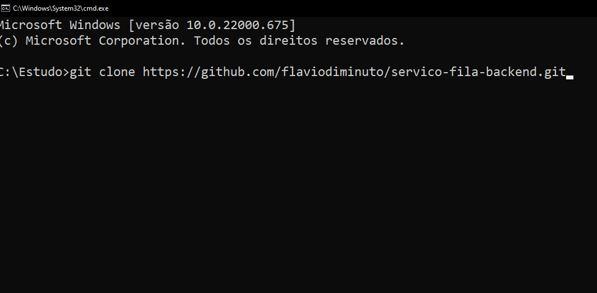
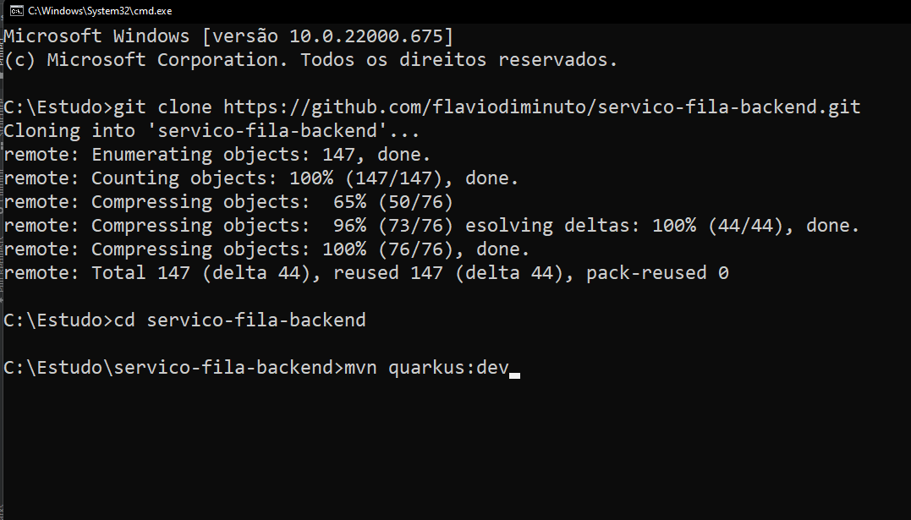

# servico-fila-backend Project

Este projeto utiliza Quarkus, o Supersônico Subatômico Java Framework

Se você quiser aprender mais sobre Quarkus, por favor visite este site: https://quarkus.io/

## Requisitos para executar o projeto
- Prompt de comando (CMD no windows, TERMINAL no Mac/Linux)
- Java 11 ou superior configurado
  - [Configurar variáveis de ambiente java](https://confluence.atlassian.com/confbr1/configurando-a-variavel-java_home-no-windows-933709538.html)
- [Maven configurado](https://maven.apache.org/install.html)
- [Docker instalado](https://docs.docker.com/engine/install/)

## Clonando o projeto em seu computador

Para ter o projeto execute o seguinte comando no terminal
https://github.com/flaviodiminuto/servico-fila-backend.git



## Criando o container com o banco de dados

Para a criação do banco de dados, com o docker instalado, realize o comando:
```shell script
docker run --name postgres-filas -p 5432:5432 -e POSTGRES_PASSWORD=hibernate -e POSTGRES_USER=hibernate -e POSTGRES_DB=hibernate_db -d postgres
```
> **_NOTA:_** Este comando inicializará o container com o usuário, senha e banco de dados definidos no arquivo .env no diretório raiz do projeto

## Executando a aplicação em modo desenvolvedor

Você pode executar a aplicação em modo desenvolvedor e fazer proveito do hot reload.
Basta acessar o terminal (cmd), navegar até o diretório do projeto e executar o seguinte comando no terminal:

```shell script
mvn quarkus:dev
```


> **_NOTA:_**  Quarkus disponibiliza uma interface no modo de desenvolvedor em http://localhost:8090/q/dev/.

## Visualizando o contrato da API com o Swagger

Para visualizar o contrato da aplicação gerado pelo swagger, basta acessar o endereço http://localhost:8090/q/swagger-ui/ no seu navegador, enquanto o projeto estiver em execução.

## Guias Relacionados

- Hibernate ORM ([guide](https://quarkus.io/guides/hibernate-orm)): Define your persistent model with Hibernate ORM and JPA
- RESTEasy JAX-RS ([guide](https://quarkus.io/guides/rest-json)): REST endpoint framework implementing JAX-RS and more

